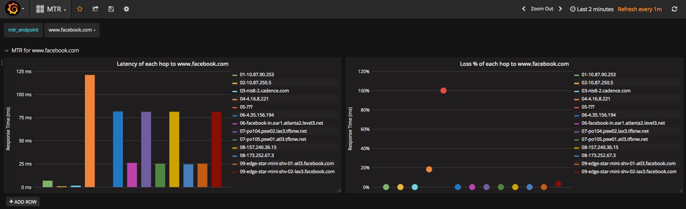

# MTR monitor

Simple MTR runner which stores data to InfluxDB and allows to preview stored data using Grafana dashboards

## Installation
### Requrements
  * `bash` shell
  * `python3`
  * `docker`
  * `mtr`
  * `influxdb` python package

## How to run
1. Edit `mtr-monitor.sh` to adjust settings to your own liking
1. `./mtr-monitor.sh`
1. Open http://127.0.0.1:5111 to access Grafana UI

## How to access InfluxDB
`./influx-cli.sh` will connect to the docker image and open CLI

## Notes

The `mtr-monitor.sh` script when run for the first time downloads grafana and influxdb docker images and creates new containers for them.
During consecutive runs it just starts already existing docker containers.
The created containers will be always started when the docker service starts.
If you want to change parameters of the container, e.g. ports, you need to remove them (e.g. `docker container rm mtr-influxdb`) and just start `mtr-monitor.sh`.

